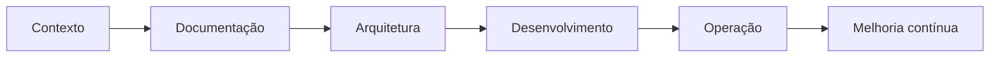

  
  
  
  

---

## Sobre

Sou um profissional híbrido entre **gestão, tecnologia, IA, automação e produtos digitais**.

Atuo na criação de soluções de ponta a ponta, conectando **documentação técnica, APIs, cloud, agentes de IA, painéis administrativos e fluxos operacionais** para transformar demandas em produtos digitais utilizáveis.

Meu foco atual está em:

* construir plataformas web com operação real;
* criar agentes de IA com contexto, regras e documentação;
* integrar APIs, automações e ferramentas open source;
* organizar processos, informações e bases de conhecimento;
* desenvolver produtos digitais com clareza, rastreabilidade e melhoria contínua.

---

## O que eu construo

<table>
  <tr>
    <td width="33%" valign="top">
      <h3>Produtos digitais</h3>
      
Plataformas web, e-commerce, delivery, painéis administrativos, sistemas operacionais internos e experiências digitais com foco em uso real.

    </td>
    <td width="33%" valign="top">
      <h3>IA e automação</h3>
      
Agentes especialistas, prompts, bases de conhecimento, integrações com APIs, automações e modelos locais para reduzir retrabalho e aumentar consistência.

    </td>
    <td width="33%" valign="top">
      <h3>Operação técnica</h3>
      
Cloud, DNS, VPS, Cloudflare, roteamento de e-mails, documentação, LGPD, regras de negócio, deploy e melhoria contínua.

    </td>
  </tr>
</table>

---

## Projetos em destaque

### Metodologia Dev

Metodologia de entrega com **IA, documentação, arquitetura, automação e produtos digitais operáveis**.

  

---

### Bruttus

Plataforma de delivery com **painel administrativo, controle de pedidos, estoque, Pix, motoboy e rastreamento por mapa**.

  

---

### Japa House

Projeto de delivery gastronômico com **cardápio digital, pedidos, estrutura operacional, status de entrega e rastreamento**.

  

---

### Shoes For You

E-commerce de calçados com **catálogo, pedidos, operação comercial, integração Pix, gestão interna e emissão de NF quando aplicável**.

  

---

### Vitrus

Produto SaaS em evolução para **comunicação visual, gestão de telas digitais, painel web e operação remota de conteúdo**.

  

---

### Bemfica Marchado

Site multilíngue com foco em **presença digital internacional, i18n, RTL, organização de conteúdo e front-end responsivo**.

---

## Stack e ferramentas

<table>
<tr>
<td align="center" width="96">
  
   <strong>React</strong>
</td>
<td align="center" width="96">
  
   <strong>TypeScript</strong>
</td>
<td align="center" width="96">
  
   <strong>Next.js</strong>
</td>
<td align="center" width="96">
  
   <strong>Node.js</strong>
</td>
<td align="center" width="96">
  
   <strong>NestJS</strong>
</td>
<td align="center" width="96">
  
   <strong>Docker</strong>
</td>
</tr>
<tr>
<td align="center" width="96">
  
   <strong>PostgreSQL</strong>
</td>
<td align="center" width="96">
  
   <strong>GraphQL</strong>
</td>
<td align="center" width="96">
  
   <strong>Cloudflare</strong>
</td>
<td align="center" width="96">
  
   <strong>GitHub</strong>
</td>
<td align="center" width="96">
  
   <strong>Figma</strong>
</td>
<td align="center" width="96">
  
   <strong>IA</strong>
</td>
</tr>
</table>

---

## Áreas de atuação

| Área                        | Atuação                                                                                                  |
| --------------------------- | -------------------------------------------------------------------------------------------------------- |
| **IA e automação**          | Agentes de IA, LLMOps, engenharia de prompt, OpenAI API, Claude API, modelos locais e automações.        |
| **Produtos digitais**       | Plataformas web, e-commerce, delivery, SaaS, painéis administrativos e fluxos operacionais.              |
| **APIs e integrações**      | Integração de sistemas, documentação de APIs, pagamentos, mapas, e-mails e automações.                   |
| **Cloud e infraestrutura**  | DNS, VPS, Cloudflare, deploy, SSL, roteamento de e-mails e ambientes web.                                |
| **Documentação e operação** | Regras de negócio, bases de conhecimento, handoff, checklists, processos e melhoria contínua.            |
| **Governança e LGPD**       | Organização de informação sensível, permissões, regras de uso e apoio a práticas responsáveis com dados. |

---

## Metodologia Dev

Meu repositório principal documenta uma metodologia própria para transformar demandas digitais em produtos operáveis:

Acesse: [github.com/herisonaraujo/metodologia-dev](https://github.com/herisonaraujo/metodologia-dev)

---

## Contato

  

&nbsp;

&nbsp;

---

<strong>IA aplicada, documentação clara e produtos digitais operáveis.</strong>  Portfólio profissional de Herison Araújo.

